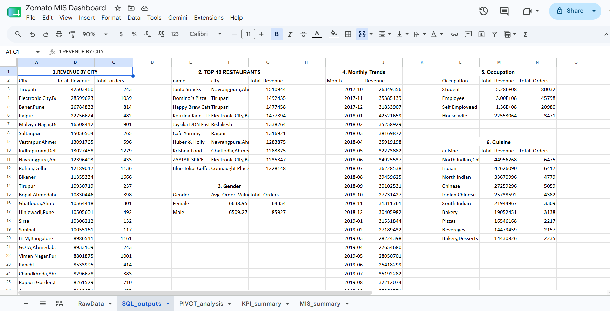
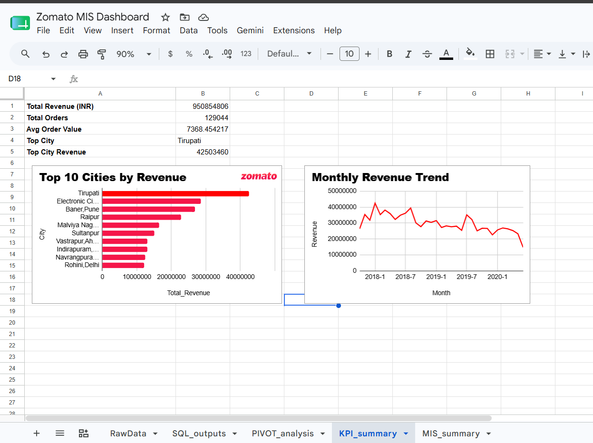
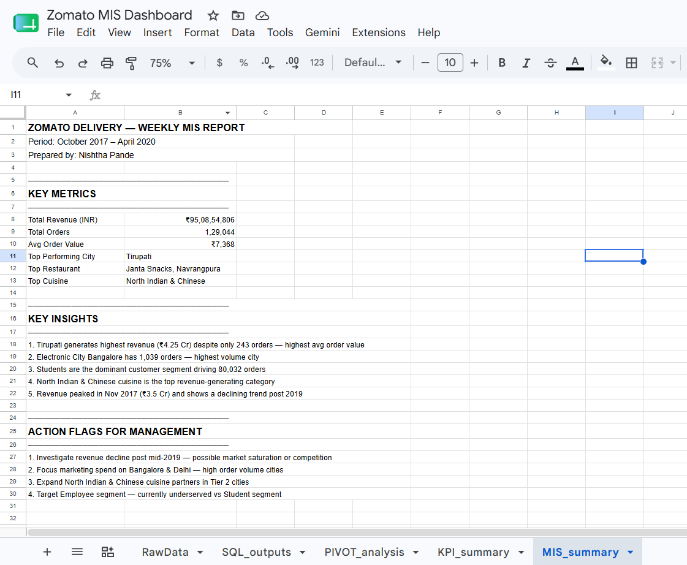

# 🍕 Zomato Delivery — MIS Dashboard

> An end-to-end MIS reporting project analyzing 1.29 lakh food delivery orders using MySQL, Google Sheets, and Excel to build stakeholder-ready dashboards.

## 📌 Project Overview

This project simulates a real-world MIS reporting workflow — extracting data via SQL queries on a relational database, transforming it in Google Sheets, and presenting it as a structured management report with KPIs, pivot analysis, and trend insights.

**Role:** Data & Reporting Analyst (solo project)  
**Duration:** July 2026  
**Dataset:** Zomato Food Delivery Dataset (6 relational tables, 1.29L orders)  
**Source:** Kaggle

## 🗓️ Project Timeline

| Phase | Task | Status |
|-------|------|--------|
| Phase 1 | Dataset acquisition and CSV conversion | ✅ Done |
| Phase 2 | MySQL setup, table imports, SQL analysis | ✅ Done |
| Phase 3 | Google Sheets — Raw Data, SQL Outputs, Pivot Analysis | ✅ Done |
| Phase 4 | KPI Summary dashboard with charts | ✅ Done |
| Phase 5 | MIS Report template | ✅ Done |
| Phase 6 | Documentation and GitHub upload | ✅ Done |

## 🗄️ Database Schema

| Table | Description |
|-------|-------------|
| orders | 1.5L order records with date, amount, user, restaurant |
| restaurant | Restaurant details — name, city, cuisine, rating |
| users | 1L user profiles — age, gender, occupation |
| menu | Menu items with cuisine and price |
| food | Food item master with veg/non-veg flag |
| orders_type | Order type classification |

## 🛢️ SQL Analysis

| Query | Description | Key Insight |
|-------|-------------|-------------|
| 1 | Revenue by City | Tirupati is #1 city with ₹4.25 Cr |
| 2 | Top 10 Restaurants | Janta Snacks leads with ₹15.1L |
| 3 | Monthly Revenue Trend | Peak Nov 2017, decline post 2019 |
| 4 | Revenue by Occupation | Students drive 80,032 orders |
| 5 | Revenue by Cuisine | North Indian and Chinese is #1 |
| 6 | Avg Order Value by Gender | Female AOV slightly higher at ₹6,639 |

## 📊 Google Sheets Dashboard

| Tab | Contents |
|-----|----------|
| RawData | Full orders dataset |
| SQL_outputs | All 6 query results with labels |
| PIVOT_analysis | Pivot table + VLOOKUP + INDEX MATCH |
| KPI_summary | Dynamic KPIs + bar and line charts |
| MIS_summary | Formatted weekly MIS report |

Functions used: VLOOKUP, INDEX MATCH, SUM, COUNTA, Pivot Tables, Advanced Filters, Conditional Formatting

## 📋 Key Insights

- **Tirupati** generates highest revenue (₹4.25 Cr) despite only 243 orders
- **Electronic City, Bangalore** has highest order volume with 1,039 orders
- **Students** are the dominant segment driving 80,032 orders
- **North Indian and Chinese** cuisine is the top revenue-generating category
- Revenue **peaked in Nov 2017** and shows a declining trend post mid-2019

## 📸 Dashboard Screenshots

| SQL Outputs | KPI Summary | MIS Report |
|-------------|-------------|------------|
|  |  |  |

## 🛠️ Tools Used

- **MySQL Workbench** — database setup, JOIN queries, aggregations
- **Google Sheets** — pivot tables, VLOOKUP, INDEX MATCH, dynamic charts
- **Excel** — MIS report formatting and download
- **Python + SQLAlchemy** — bulk CSV import into MySQL
- **GitHub** — version control with phase-wise commits

## 👩‍💻 Author

**Nishtha Pande**  
B.Tech Mechanical Engineering, NSUT Delhi (2024–2028)  
📧 nishtha17.04.06@gmail.com  
🔗 [GitHub](https://github.com/nishthapande)
